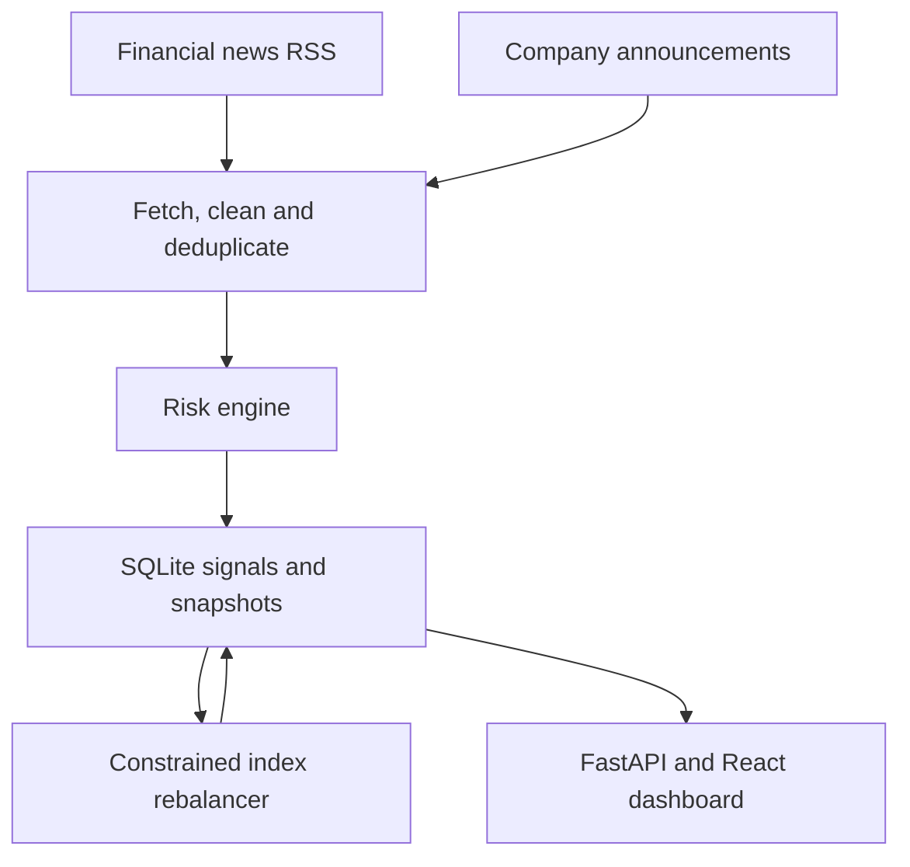

# RiskPulse

**Financial Risk Intelligence and Sentiment-Based Mock Index Rebalancing**

Hackathon implementation: unified AI/NLP Risk Engine + **Module A**. The engine consumes financial news and company announcements, exposes structured risk signals, and updates a mock allocation across ten stocks. This repository includes the backend, dashboard source, prebuilt dashboard, synthetic datasets, tests, presentation, and demonstration scripts.

## Submission information

- Presenter: Tanish Singh. Confirm your official team/member details before submission.
- Selected module: **A - Tactical Index Rebalancing**.
- Repository: use this public repository's URL after publishing.
- Presentation: [`docs/presentation.pdf`](docs/presentation.pdf), seven slides. Editable version: `docs/presentation.pptx`.
- Live demonstration: follow [`docs/DEMO_SCRIPT_5_MIN.md`](docs/DEMO_SCRIPT_5_MIN.md), within five minutes.
- Recorded walkthrough: follow [`docs/VIDEO_WALKTHROUGH_10_MIN.md`](docs/VIDEO_WALKTHROUGH_10_MIN.md), then put the accessible video link in your submission.
- Final packaging: [`docs/SUBMISSION_CHECKLIST.md`](docs/SUBMISSION_CHECKLIST.md). The full organizer README template and AI rules were not available as readable text during implementation. Compare this README against the original before submitting.

## What the application does

1. Fetches public headlines and summaries from BBC Business, Apple Newsroom, and Microsoft's corporate blog. Yahoo Finance and GDELT are optional connectors.
2. Cleans HTML and deduplicates normalized headlines.
3. Identifies companies using the configured alias universe.
4. Runs **ProsusAI FinBERT** locally on CPU for sentiment. Event classification uses auditable phrase rules. Impact uses a documented severity heuristic.
5. Writes signals and allocation snapshots to SQLite.
6. Tilts an equal-weight mock index using eligible company sentiment, with weight and turnover constraints.
7. Shows source status, signal evidence, current allocation, and weight history. Exports JSON/CSV and offers a REST API.

**Live feeds and synthetic replay use separate portfolios.** Live-source errors remain visible. The application never fills a failed live source with fictional records.

## Requirements

- Python **3.11 or newer**, with pip and venv. Validation here used Python 3.12 on Linux.
- Windows, macOS, or Linux. Windows launch scripts are provided, but Windows execution was not tested here.
- Internet for dependency/model installation and live feeds. Cached model inference and synthetic replay run locally.
- Several GB of free disk space/RAM for the optional PyTorch + FinBERT setup. The model weight file alone is about **438 MB**.
- **Node is not needed to run the included prebuilt dashboard.** To change the frontend, use Node 24 and npm.

## Quick start on Windows

1. Extract the project ZIP fully. Open the `riskpulse` folder, not the ZIP preview.
2. Install Python 3.11+ if necessary. During installation, enable **Add Python to PATH**.
3. Double-click **`start.bat`**. Keep the terminal open. The first run installs the base dependencies.
4. Open **http://127.0.0.1:8000** in Chrome/Edge.
5. Select **Synthetic replay**, then click **Run synthetic scenario** or **Next replay event**. Open **Index allocation** to see changed weights.

The base installation can run with the clearly labeled financial-lexicon fallback. To demonstrate the full FinBERT model:

1. Stop the server with Ctrl+C after the base environment exists.
2. Double-click **`scripts\enable_finbert.bat`**. This installs CPU PyTorch/Transformers and downloads the pinned model once.
3. Restart **`start.bat`**. Wait until the dashboard model status says **finbert** before recording.
4. Internet is needed for this first setup. A failed model download leaves the fallback visible, with a diagnostic message in Policy settings.

## Quick start on macOS/Linux

```bash
cd riskpulse
bash start.sh
```

For FinBERT, stop the server and run:

```bash
.venv/bin/python -m pip install 'torch>=2.6,<3' --index-url https://download.pytorch.org/whl/cpu
.venv/bin/python -m pip install transformers==5.19.0
.venv/bin/python scripts/setup_model.py
.venv/bin/python run.py
```

The setup script uses the model's pinned revision and records downloaded-file hashes. It does not include model weights in the source repository.

## Clone, install, and run from GitHub

Replace `YOUR_USERNAME` with the owner of the repository you publish. These are the exact commands a reviewer can use after replacement:

```bash
git clone https://github.com/YOUR_USERNAME/riskpulse.git
cd riskpulse
python3 -m venv .venv
.venv/bin/python -m pip install -r requirements.txt
.venv/bin/python run.py
```

On Windows use `py -3 -m venv .venv`, then `.venv\Scripts\python.exe` instead of `.venv/bin/python`. Open http://127.0.0.1:8000. Use the FinBERT steps above for the full model rather than the base fallback.

## Two source types

| Source | Text type | Connector | Default refresh |
|---|---|---|---|
| BBC Business | Financial news | RSS | Yes |
| Apple Newsroom | Company announcements | RSS/Atom | Yes |
| Microsoft corporate blog | Company announcements | RSS | Yes |
| Yahoo Finance headlines | Financial news | RSS | Optional |
| GDELT global news | Financial news discovery | DOC API | Optional |

On 8 October 2026, a real fetch successfully ingested **20 BBC + 20 Apple + 10 Microsoft items**. That verifies connectivity at that time, not future availability. Yahoo/GDELT can reject or rate-limit requests. **No paid API key is required for the configured connectors.** Access still depends on the source and network.

The automatic poller runs every 300 seconds by default while the server is running. Enable it in **Data sources**. Manual refreshes have a 30-second per-source cooldown. The main Refresh sources button selects BBC, Apple, and Microsoft. Automatic polling checks all configured sources. This is near-real-time RSS polling, rather than exchange-grade high-frequency trading.

Analysis uses **headlines and available summaries**, not full paywalled articles. RSS publication/update time drives freshness. Missing times are explicitly marked as inferred. GDELT's `seendate` is a discovery time and may differ from publication time. See [`docs/DATA_SOURCES.md`](docs/DATA_SOURCES.md).

## Signal schema

Every analyzed company/event produces the three required fields and supporting evidence:

```json
{
  "ticker": "JPM",
  "sentiment_score": -0.94,
  "sentiment_label": "negative",
  "event_classification": "Credit Event",
  "impact_score": 9,
  "confidence": 0.94,
  "impact_method": "heuristic",
  "model_backend": "finbert",
  "entity_scope": "single_company"
}
```

This is an illustrative schema example. Actual output depends on the text and active backend. FinBERT sentiment is `P(positive) - P(negative)` in [-1, 1]. Its label is the most probable class and confidence is that class probability. A neutral class can have a signed numerical score, so the rebalancer also excludes neutral labels.

Supported event categories: Geopolitical, Macroeconomic, Credit Event, Merger/Acquisition, Product Launch, Regulatory, Operational, Earnings, and Other. Event evidence records matched phrases. Impact starts from an event baseline and adjusts for severity/mitigating phrases and strong sentiment, clamped to 1-10. **Impact is an uncalibrated severity proxy, not a validated forecast of price movement.**

## Allocation policy

Mock universe: AAPL, MSFT, NVDA, AMZN, GOOGL, META, JPM, XOM, JNJ, WMT. These are ten example companies, not a claim about current official S&P index membership.

The initial baseline is 10% each. For stock i, eligible sentiment receives a strength of:

```text
strength = confidence * source_reliability * 0.5 ** (age_hours / half_life_hours)
stock_score = weighted_mean_sentiment * min(1, total_strength)
raw_target = equal_weight * exp(sensitivity * stock_score)
```

Normalize targets to 100%, project onto weight limits, and interpolate toward the target until the one-way turnover limit is met. One-way turnover is half the sum of absolute weight changes.

| Control | Default |
|---|---:|
| Minimum/maximum stock weight | 2% / 18% |
| Maximum one-way turnover per normal update | 10% |
| Sentiment half-life | 12 hours |
| Maximum signal age | 72 hours |
| Minimum confidence | 0.55 |
| Minimum absolute sentiment | 0.08 |
| Sensitivity | 0.35 |

The engine excludes neutral, stale, low-confidence, future-dated, global, and ambiguous shared-company context from company allocation. Source reliability coefficients are **policy assumptions**, not measured source-accuracy scores. Positive/negative sentiment tilts the target relative to the equal-weight baseline and other stocks. A weight can fall when an older positive signal decays. Repeatedly clicking Recompute does not compound the same news into an ever-larger target.

New mandatory weight limits take precedence: a policy-compliance correction can exceed the usual turnover limit if current weights violate the new limits. This exception appears in snapshot reasons and the dashboard.

## API examples

Interactive API documentation: **http://127.0.0.1:8000/docs**. Its Swagger assets need internet. Raw schema is available locally at `/openapi.json`.

```bash
curl http://127.0.0.1:8000/api/health
curl 'http://127.0.0.1:8000/api/overview?mode=replay'
curl -X POST http://127.0.0.1:8000/api/replay -H 'Content-Type: application/json' -d '{"reset":true,"count":1}'
curl -X POST http://127.0.0.1:8000/api/analyze -H 'Content-Type: application/json' -d '{"title":"Synthetic: Apple reports record profit and raises guidance."}'
curl 'http://127.0.0.1:8000/api/export?mode=replay&format=json'
```

`/api/analyze` previews without saving. `/api/ingest` saves and recomputes. `/api/refresh` fetches selected live connectors. `/api/signals` supports mode/ticker/event/search filtering. `/api/import` accepts UTF-8 CSV/JSON, at most 100 records and 256 KB, validating all rows before saving. A JSON import is an array of article objects. A CSV example is `data/sample_import.csv`. Imported rows use the selected workspace and analyst-input reliability of 0.7.

## Architecture



Detailed component mapping and design decisions: [`docs/ARCHITECTURE.md`](docs/ARCHITECTURE.md). Simple Hinglish explanation: [`docs/EXPLANATION_HINGLISH.md`](docs/EXPLANATION_HINGLISH.md).

## Data and reproducibility

- `data/replay_events.json`: 12 clearly labeled fictional events, with publication times rebased when replaying. Replay is separate from live data.
- `data/sample_import.csv`: equivalent synthetic texts for demonstrating import.
- `data/evaluation.json`: 24 separately authored synthetic sentiment/event sanity cases. These are not a real-news benchmark.
- `data/universe.json`: company aliases and mock stock universe.
- Live article text remains in the local runtime database and is excluded from the repository. Source content retains its provider's rights.
- `runtime/` holds the database and optional downloaded model. Delete only your local database to clear all data, or use Reset and replay to clear replay alone.

## Validation and measured results

Validation in this Linux environment with FinBERT installed:

- **28 automated tests passed**, including API/import validation, deduplication, live/replay separation, restart persistence, allocation direction, neutral handling, time decay, turnover limits, bounded weight projection, entity ambiguity, and actual FinBERT inference.
- **24/24 sentiment labels and 24/24 event labels matched** the small synthetic sanity set. It has eight cases per sentiment class. This result does not establish real-world accuracy or predict investment returns.
- Mean analysis time **80.47 ms**, sample p95 **95.44 ms**, on those 24 cases, CPU model already loaded. Includes engine analysis, excludes model startup and network fetching. Timings depend on hardware and text length.
- Real source fetch: 50 items across three connectors and two source types.
- The homepage, bundled assets, and API endpoints responded in an HTTP smoke check. The frontend production build completed.
- **Browser interaction/visual QA was unavailable in the managed build environment.** Inspect the dashboard on your laptop before recording. Windows scripts and Docker were not executed here. PowerPoint/Google Slides application behavior was not inspected; presentation previews and package checks cover the generated deck.

Run the checks yourself:

```bash
.venv/bin/python -m pip install -r requirements-dev.txt
.venv/bin/python -m pytest -q
.venv/bin/python scripts/evaluate.py
```

Without a cached FinBERT model, its integration test skips. `evaluate.py` prints the active backend, so do not report its result as FinBERT if model loading fell back.

## Modify the dashboard

```bash
cd frontend
npm ci
npm run dev
# For the bundled production app:
npm run build
```

Vite proxies `/api` to port 8000 in development. Keep the Python server running. After a production rebuild, open the Python-served dashboard at port 8000.

## Configuration and optional Docker

Copy `.env.example` to `.env` when changing settings. The defaults bind only to your laptop. `SENTIMENT_BACKEND=lexicon` deliberately selects the fallback. `AUTO_POLL=true` enables polling at startup. `RISKPULSE_DB` selects the SQLite path. `POLL_SECONDS` has a minimum of 120 seconds. Use one server process for this prototype.

For an external deployment, set a strong `RISKPULSE_API_TOKEN`, bind an appropriate host, and provide HTTPS at the hosting layer. Enter the same token in the dashboard Policy connection settings. The token protects data/mutation API endpoints. Public health/schema endpoints expose only status/schema. The prototype has no multi-user authorization or trading execution.

```bash
docker build -t riskpulse .
docker run --rm -p 8000:8000 -v riskpulse-data:/app/runtime -e RISKPULSE_API_TOKEN=YOUR_OWN_TOKEN riskpulse
```

The supplied lightweight Docker image uses the **lexicon backend**, not FinBERT, and was not built here. Run the documented local FinBERT setup for the full NLP demonstration. Never commit your real token, `.env`, model weights, or local database.

## Troubleshooting

- Python command missing: install Python and reopen the terminal. Windows launchers try `py` and then `python`.
- Port 8000 busy: copy `.env.example` to `.env`, change `PORT=8001`, restart and open that port.
- FinBERT unavailable: check internet/disk space, rerun the setup script inside the project venv, and restart. The dashboard shows the actual backend and model error.
- Feed error or 429: wait, inspect Data sources, retry that source, or use the explicitly synthetic replay for the demo.
- Live allocation unchanged: headlines may be global, old, neutral, low-confidence, or outside the ten-company universe. This is expected filtering, not a fabricated result.
- Empty live history: fetch first. The equal-weight initial snapshot is genuine startup state.
- Import rejected: use the provided UTF-8 CSV/JSON schema, recognized ticker names, and valid HTTP/HTTPS URLs.
- Missing dashboard build: run `npm ci` and `npm run build` inside `frontend`.
- Blank API docs offline: use `/openapi.json` or the API examples above.

## AI use and license

See [`AI_USAGE.md`](AI_USAGE.md) for assistance disclosure and required human review. Original project source and synthetic fixtures use the MIT license in `LICENSE`. FinBERT and third-party libraries/assets retain their own licenses. No confidential banking or client dataset is included. This project implements Module A only and makes no backtested return, trading-performance, or production-risk claim.
